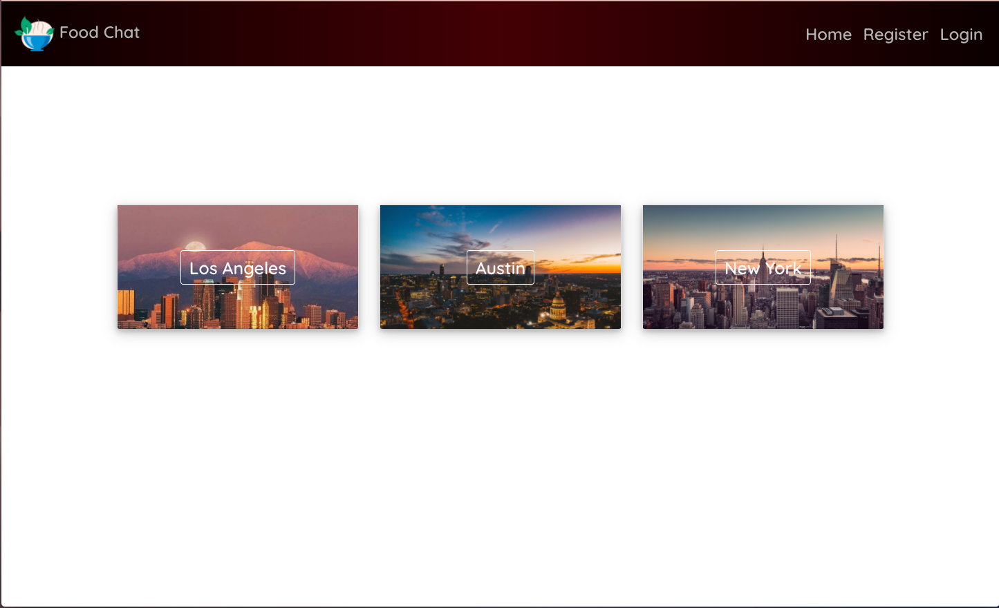
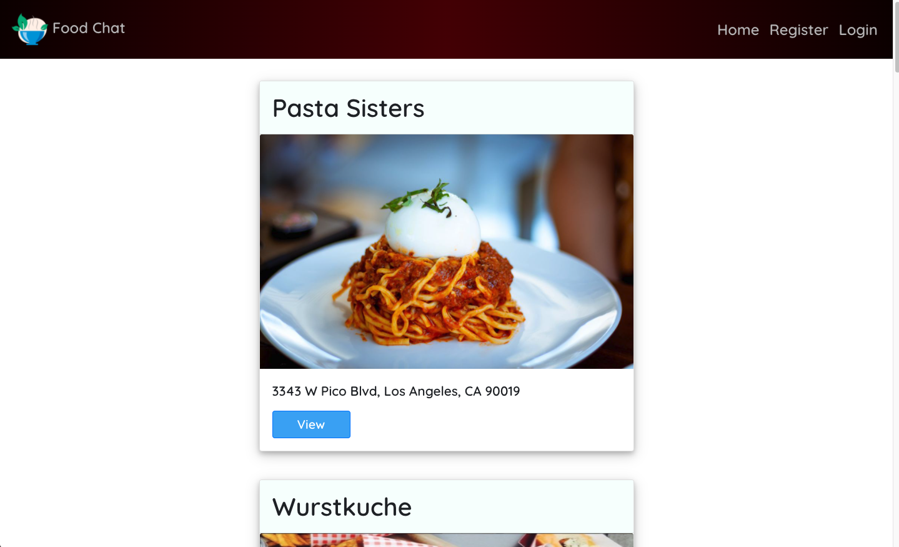

# Project-3-FoodChat 
### Description 
FoodChat is a fully responsive application that allows users to create posts on the best or worst dish at the top 10 restaurants in Los Angeles, New York, and Austin. Users are able to post a dish, their  description of that dish, and whether or not they would revisit the restaurant. FoodChat also allows users to delete and edit posts. 





### Technologies 

The technologies for the front-end of this project include:
- ReactJS
- ReactRouter
- ReactBootstrap
- Styled Components (Library for maintainable CSS)

### Getting Started

To get started, navigate over to https://food-chat323.herokuapp.com/ where three cities will appear. Click on whichever one you'd like and select a restaurant from that city's top 10. Then start creating posts!

### Installation Instructions 

- Fork and clone this repo to your CLI
- Run ```npm i``` to install the needed dependencies
- Once complete, feel free to open up the folder in your code editor and run ```npm start``` to set up a test server

#### Future Features

- User Login and Sign In